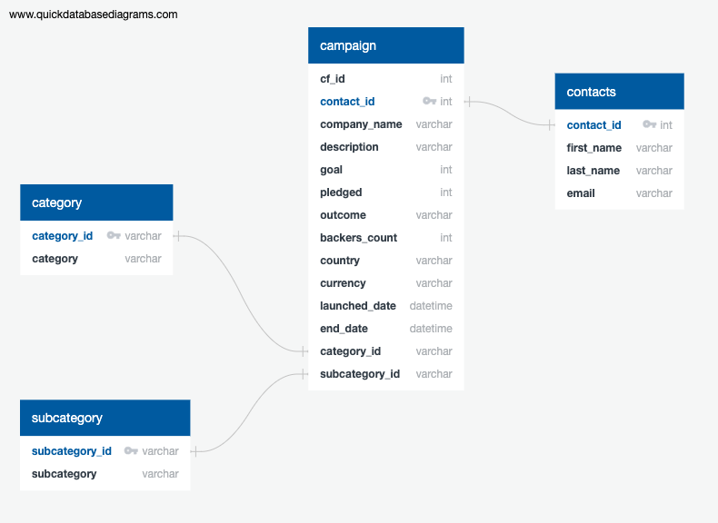

# ETL Mini Project 
This  project is part of a Data Analytics bootcamp hosted by Edex and Northwestern.

#### --Project Status: [Completed]

## Project Intro/Objective

This project will clean and organize data into a presentable format. It will also turn the cleaned .xlsx files into csv files to be made into a cisualized schema.

### Partners
* Matthew Hill
* Ben Belczak

### Technologies
* Python
* Pandas
* Numpy
* Json
* PostgresSQL
* etc.

## Getting Started
1. Download the starter files from either the class repo or from the bootcamp website (project 2)
2. Run all of the cells in the ETL_Mini_Project_MHill_BBelczak.ipynb file. Doing this should clean and organize all of the data in the 2 excel files (contacts.xlsx, and crowdfunding.xlsx). This will create 4 csv files - (campaign.csv, category.csv, subcategor.csv and contacts.csv).
3. Go to this website [QuickDBD](https://www.quickdatabasediagrams.com) and create an ERD of the csv files you just made and save the new ERD file. ERD schema shoude look like image show below:

    

4. Go to postgreSQL PgAdmin and create a Data Base. Create all of the tables for each csv file in order of:
        
    *1: category, 2: subcatecory, 3: contacts, and 4: campaign.*

